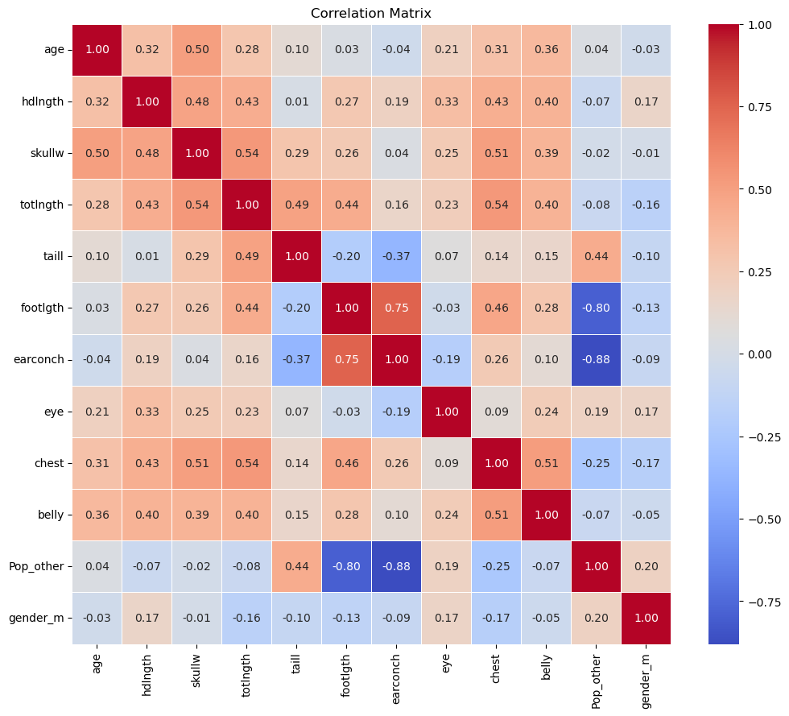
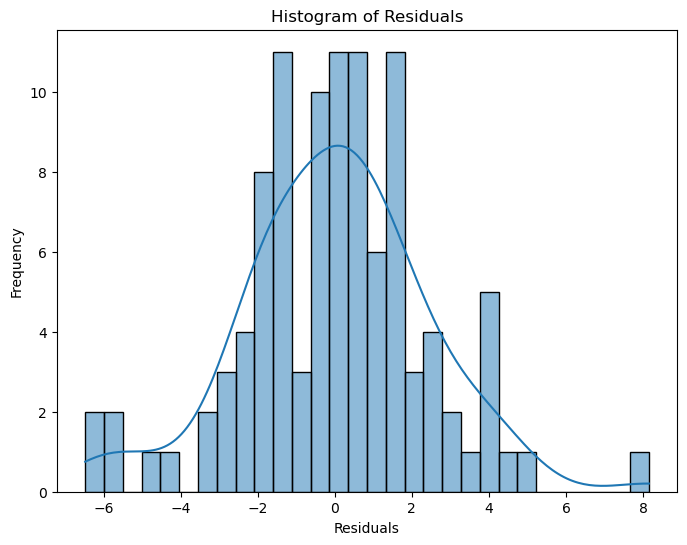
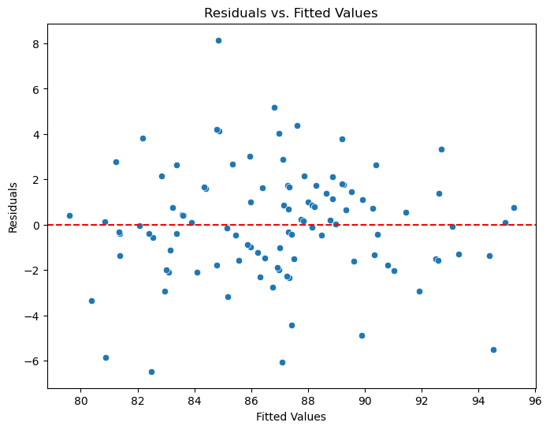

# Statistical Modelling in Python: Hypothesis Testing and Regression

A complete statistical workflow on a small biological measurement dataset: cleaning, exploratory analysis, hypothesis testing and linear regression, with every model assumption checked. The dataset is the well-known *possum* morphometric dataset (104 animals, 14 variables).

**Tools:** Python (pandas, NumPy, Matplotlib, Seaborn, SciPy, statsmodels) · Jupyter

---

## Workflow

1. **Data cleaning.** Converted text columns to numbers. Filled missing values with medians grouped by site and sex, so each filled value comes from comparable animals. Used boxplots to find and correct impossible values, such as a negative tail length and a skull width over 1,000 mm.
2. **Exploratory analysis.** Checked skewness (all variables between −0.5 and 0.5, so no transformation was needed), plotted histograms and a pairplot, and built a correlation matrix.
3. **Hypothesis testing.** Ran two-sample t-tests at α = 0.05:
    - Head length, Victoria vs other regions: no significant difference (p = 0.58).
    - Total length, male vs female: no significant difference (p = 0.10).
4. **Simple linear regression.** Fitted three models, each significant at p < 0.001:
    - skull width → head length (R² = 0.23)
    - tail length → total length (R² = 0.23)
    - chest girth → belly girth (R² = 0.27)
5. **Multiple linear regression.** Predicted total length from all measurements, sex and region. Checked multicollinearity with VIF (all below 10). **The final model explains 68% of variance (R² = 0.68, adjusted R² = 0.64).**
6. **Assumption checks.** Tested linearity, normality of residuals and homoscedasticity with residual plots.

---

## Visuals

---

## Data

The possum dataset is publicly available from the R `DAAG` package and from Kaggle. Place `possum.csv` next to the notebook to run it.

---

*Nouviboth Ra · [LinkedIn](https://www.linkedin.com/in/nbothra)*
